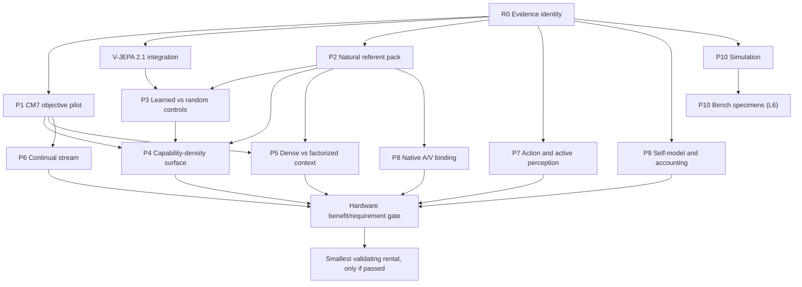

# Extended-compute execution plan

> LIVE INTEGRATION 2026-07-10: this portfolio remains design context. The active order is
> `MOP_MAXIMUM_POTENTIAL_EXECUTION_PLAN.md`. The operational maximum is 300 minutes; registered
> scientific shards remain unchanged.

Snapshot: 2026-07-10  
Decision owner: Form Substrate program  
Current decision: **no procurement, no cloud rental, no distributed campaign**

## Outcome and operating rule

The next 180 days should spend compute only on evidence that can change a scientific decision. The
current registry has 168 category-1 rows, 10 category-2 rows, 19 category-3 rows, and no category
4-9 rows. The complete 291-row planning matrix has 168/90/29/4 rows in categories 1/2/3/6, zero
category 8/9 rows, and zero `hardware_required:true` rows.

The escalation rule is:

```text
clear validity/data/environment blocker
  -> run smallest local mechanics
  -> estimate variance and profile the complete workload
  -> attack local memory/time requirements
  -> pass a named benefit or requirement gate
  -> rent the smallest validating rung
  -> consider purchase only from measured repeated demand
```

No historical `studio-scale`, `gpu-later`, model name, package guard, parameter count, or rough FLOP estimate can skip a step.

## Evidence states

Every artifact produced under this plan must declare one state:

1. **mechanics:** finite execution and schema integrity only;
2. **pilot:** a small preregistered variance/validity study;
3. **confirmatory:** powered independent units with multiplicity and dependence handled;
4. **comparative benefit:** same workload on two rungs at numerical/data-order parity;
5. **hardware requirement:** an irreducible resident-state, real-time, or inseparable-interaction boundary.

State 1 cannot be described as a scientific verdict. State 3 cannot be described as a hardware requirement. State 4 earns category 8 only. State 5 earns category 9 only when all requirement-gate fields pass.

## Ranked portfolio

| Rank | ID | Experiment/program | First rung now | Primary blocker now | Decision value |
|---:|---|---|---|---|---|
| 0 | R0 | Evidence identity and stale-chain repair | L0 | Implementation/integrity | Makes every later result citable |
| 1 | P1 | CM7 four-objective paired tournament | Closed exact rung | Five-seed familywise null is bound | Retire this regime and carry its platform contracts forward |
| 2 | P2 | Session-diverse natural referent pack | L0 after intake | Rights/provenance/data | Removes the largest shared blocker |
| 3 | P3 | Learned versus same-architecture random controls | L1 serial | Implementation/control | Separates pretraining from architecture/resolution |
| 4 | P4 | Small-substrate capability-density response surface | L1 | Design/implementation | Tests alternatives to parameter scaling |
| 5 | P5 | Exact dense context versus factorized memory | L0/L1 | Implementation, then measurement | Strongest possible future resident-memory gate |
| 6 | P6 | Million-event bounded continual stream | L0/L1 | 384-event mechanics pass; 10k calibration is next | Tests plasticity and lifetime density |
| 7 | P7 | Action-conditioned and active-perception loop | L0/L1 after external inputs | Programmatic mechanics pass with a fixture null; independently sourced trajectories and an exact-referent control remain | Tests intervention and real-time claims cheaply |
| 8 | P8 | Native audiovisual binding | L0/L1 after data | Aligned A/V rights and split discipline | Tests temporal binding rather than pooled proxy forms |
| 9 | P9 | Operational self-model plus full-system density | L0 after external workload intake, later L6 meter | Structural mechanics pass; independent workload/failure episodes and metered energy remain | Measures failure prediction and actual resource cost |
| 10 | P10 | Material simulation, then specimen validation | L0 simulation, L6 bench | Simulator first; specimens later | Separates algorithm value from material value |

R0 is not a scientific experiment and receives no promotion claim. P1-P10 are the candidate experiments subjected to the twelve adversarial questions below.

## Statistical stages shared by P1-P10

| Stage | Units | Purpose | Allowed claim |
|---|---:|---|---|
| Smoke | 1 seed/unit | Catch code, data, split, metric, and recovery failures | Mechanics only |
| Variance pilot | 5 paired independent units | Estimate paired effect, variance, paired correlation, clustering, time, and memory | Pilot direction; no confirmatory verdict |
| Confirmatory default | Recalculate; 22 only if `d_z=.8`, two-sided α=.01, power .80 assumptions survive | Test one named endpoint/family | Confirmatory claim |
| Moderate-effect sensitivity | 51 pairs for `d_z=.5`, same α/power | Exposes the cost of a smaller SESOI | Confirmatory claim if feasible |

The alpha .01 value is the conservative Bonferroni/first-step Holm planning threshold for five named comparisons, not a universal Holm threshold. Each experiment must name its endpoint, smallest effect of scientific interest, variance source, independent unit, nested/crossed observations, and stopping rule. Referents evaluated under one trained model are repeated measures, not automatically independent units. Sequential looks require preregistered alpha spending or an anytime-valid confidence sequence.

## R0. Evidence identity and stale-chain repair

### Tasks

1. Preserve the closed CM7 five-seed portable chain and its familywise-corrected null. Do not revive
   the exact regime with more seeds after its preregistered decision closed.
2. Preserve the completed SANPO execute receipt and verify it against its current plan identity. Do not convert an 80-frame smoke set into a scientific-data claim.
3. Regenerate or explicitly retire the stale project-exhaustion, frontier-localization, standalone encoder-forward, and F artifact-index chains.
4. Rebuild the F scorecard so F8/F16 carry current data/environment semantics; retain F10's failed independent-verifier gate and the F13/F18/F20 redesign warnings.
5. Validate all current cache manifests with their schema-aware digest rules. The quarantined random-init ViT-L artifact remains uncitable.
6. Preserve the verified official dense ViT-B strict-load, 8/64-frame forwards, and E6/DR14
   cache/control integration. Its next gate is the rights-clean annotated natural cohort, not more
   model integration.
7. Run the requirements builder and its negative gate tests after sources settle.
8. Preserve `proof/LOCAL_ACTION_ENVIRONMENT.json` as programmatic mechanics only; use its explicit remaining-blocker map for E10/CM10 rather than promoting an embodiment/open-endedness claim.

### Exit criteria

- The requirements matrix rebuilds byte-for-byte with no unresolved row evidence ID.
- Known stale artifacts are excluded from authoritative row evidence or regenerated current.
- Fabricated evidence IDs, incomplete category-9 gates, and category/hardware inconsistencies fail validation.
- No active process is writing an artifact used as immutable evidence.

## P1. CM7 four-objective paired tournament

### Experiment card

| Field | Specification |
|---|---|
| Hypothesis | At least one teacher-free objective improves held-out temporal/factor structure over reconstruction, random-target, and matched alternatives at fixed initialization, architecture, updates, and active compute |
| Independent unit | Training seed; referent/session outcomes are repeated measures within a seed unless a hierarchical design names sessions as the population |
| Inputs | First, exact programmatic referents for mechanics; then P2 session-disjoint natural referents |
| Smallest model | Current 1,646,080-parameter CM7, 256 dense tokens |
| Controls | Predictive, reconstruction, invariance, random-target; exact frozen initialization; shuffled-time and label/readout controls where registered |
| Seeds/power | Finish five paired seeds for variance only; calculate confirmatory n from observed paired differences; planning sensitivity 22 at `d_z=.8`, 51 at `.5`, α=.01, power .80 |
| Memory/storage/time | Measured calibration proves local fit. Engineering estimate: about 15-20 minutes per four-arm seed from current arm timings; 5 seeds about 75-100 minutes, 22 about 5.5-7.3 serial hours. Re-measure final v3. Count model-only and resumable checkpoint bytes separately |
| Local optimization | Sequential arms/seeds, atomic checkpoints, fixed preprocessing, batch-1/microbatch if needed, no resident teacher |
| Rung | L0 for each shard, L1 for a full sequential confirmatory campaign |
| Promotion gate | Surviving off-ceiling paired effect, stable variance, valid controls, and measured campaign time; only a later same-workload cross-rung test can earn category 8 |
| Null rule | All objective differences lie inside the preregistered SESOI interval |
| Kill rule | Kill or redesign any objective whose gain disappears under random-target, shuffled-time, matched compute, or natural-data replication |
| Reusable artifact | Source-snapshotted checkpoints, exact initial state, per-arm receipts, split manifest, paired seed table, memory/time trace, aggregate gate |

### Twelve adversarial answers

1. **Uncertainty removed:** whether the project-owned objective adds structure beyond architecture and training exposure.
2. **Why local result is insufficient:** calibration has one seed and three updates; incomplete historical runs are not a sampling distribution.
3. **Smallest answer:** the current 1.646M model, four objectives, five-seed variance pilot.
4. **Factorization:** arms and seeds serialize exactly; checkpoints resume them.
5. **Parallelism:** elapsed time only; it does not change validity.
6. **Equal-compute control:** random-target and reconstruction at the same updates, initialization, tokens, and parameter count.
7. **Null closes:** objective choice at this model/data regime; it argues against scaling that objective.
8. **Next rung:** only a surviving powered effect plus measured L1 calendar cost can justify an L3 throughput benchmark.
9. **Permanent demotion:** gain fails matched controls or natural replication at two budgets.
10. **Scale confound:** changing model width with objective would confound capacity and objective; prohibit it in P1.
11. **Independent unit:** paired training seed, with repeated referents nested/crossed explicitly.
12. **Reusable artifact:** frozen checkpoints and citable dense-token caches for P3-P8.

## P2. Session-diverse natural referent pack

### Experiment card

| Field | Specification |
|---|---|
| Hypothesis | Effects that survive session-disjoint natural referents differ materially from programmatic-ceiling results and expose the real objective/control ranking |
| Independent unit | Source session or creator/source collection, not frame or crop |
| Inputs | Start with completed SANPO smoke mechanics; separately audit AViD, per-item CC YFCC/Wikimedia, or another approved source. No terms are accepted by this plan |
| Smallest model | Frozen ViT-L control and CM7 readout first; no inherited-scale expansion |
| Controls | Session-disjoint split, source/creator grouping, duplicate and near-duplicate removal, pixels/random architecture, byte-identical referent manifest |
| Seeds/power | Dataset diversity is not a substitute for training seeds. Power the primary model contrast over the declared session population using hierarchical/bootstrap analysis |
| Memory/storage/time | SANPO smoke is roughly 289 MB planned. Preserve ≥40 GB free. Derived caches are sharded; dense fp16 64f/256 ViT-L is 16.78 MB/clip before metadata, so the receipt's 2.135 GB safe headroom would hold only about 127 such hypothetical clips |
| Local optimization | Stream decode, compact raw smoke, deterministic derived views, pooled cache for screening, dense cache only for a named test |
| Rung | Category 3 until rights/provenance pass; then L0/L1 |
| Promotion gate | Minimum independent-session count, complete attribution/deletion/provenance state, verified split, and an off-ceiling pilot |
| Null rule | Natural session effects remain at chance/ceiling in a way that cannot distinguish objectives |
| Kill rule | Kill a source if rights, privacy, deletion, attribution, session identity, or leakage cannot be made auditable |
| Reusable artifact | Immutable source manifest, license/access record, hashes, session groups, transforms, derived-cache lineage, deletion log |

### Twelve adversarial answers

1. It removes uncertainty caused by synthetic ceilings and repeated frames.
2. Current programmatic eight-row results cannot estimate natural/session variance.
3. The smallest answer is a session-disjoint smoke pack, not a web-scale corpus.
4. Media streams from disk; derived views and caches are resumable.
5. Parallel decode changes time only and can complicate deterministic ordering.
6. Same-byte pixel/random/frozen baselines consume the matched evaluation budget.
7. A null closes claims that natural diversity alone reveals the registered effect at this sampling frame.
8. More data is justified only by estimated session variance and an off-ceiling endpoint, not clip count.
9. Permanently reject sources without auditable rights, grouping, or deletion handling.
10. Do not change source, model, resolution, and objective in one comparison.
11. The independent unit is session/source group.
12. The reusable output is the provenance-preserving referent packet, not a leaderboard score.

## P3. Learned versus same-architecture random controls

### Experiment card

| Field | Specification |
|---|---|
| Hypothesis | Learned weights improve the named transfer/invariance endpoint over architecture-matched random initialization at identical bytes, preprocessing, geometry, and readout budget |
| Independent unit | Paired training/random seed and independent referent session; analyze crossed structure rather than treating clips as n |
| Inputs | Existing citable ViT-L control plus P2 referents; build active ViT-B/custom learned and random controls only for named tasks |
| Smallest model | One retained frozen control and one owned compact substrate; no legacy scale ladder |
| Controls | Same architecture, resolution, frame count, preprocessing, precision, seed ledger, and readout rank; pixels and shuffled labels |
| Seeds/power | Start with 3 random-weight seeds × P2 sessions; estimate variance before scale expansion |
| Memory/storage/time | The retained ViT-L pooled control measured 22.335 s/clip on eight programmatic clips. The dense ViT-B 64-frame forward measured 25.2 s after strict load. Re-measure complete natural-cache construction, including decode, finalization, and verification |
| Local optimization | Sequential model/seed caches, content-addressed manifests, frozen inference, pooled screening before dense tokens |
| Rung | L1 serial |
| Promotion gate | Valid natural-session learned/random delta, active custom control, and measured complete campaign wall |
| Null rule | Learned-random delta is inside SESOI at L on natural referents |
| Kill rule | Kill scale expansion if endpoints remain at ceiling/floor or random weights tie learned weights across two referent budgets |
| Reusable artifact | Same-referent learned/random cache family with checkpoint/state-dict, preprocessing, and referent hashes |

### Twelve adversarial answers

1. It identifies whether pretraining, not architecture or resolution, carries the signal.
2. Historical scale controls are retired; the active ViT-B/custom natural-task controls are not yet materialized.
3. ViT-L, a small natural packet, and three random seeds answer first.
4. Every model/seed serializes and caches.
5. Parallelism affects elapsed time only.
6. Random same-architecture weights are the compute-matched scientific control.
7. A null demotes inherited-encoder claims and favors smaller project-owned substrates.
8. A new inherited scale is not justified by this card; structural successors are tested in P4.
9. Kill any cache whose weights, preprocessing, source bytes, or manifest cannot be verified.
10. Hold resolution and token/readout geometry fixed where possible; otherwise declare the interaction.
11. Independent units are weight seed and source session under a crossed model.
12. Caches become reusable teachers, controls, and measurement instruments.

## P4. Small-substrate capability-density response surface

### Experiment card

| Field | Specification |
|---|---|
| Hypothesis | Referent diversity, temporal memory, interventions, or architecture diversity produces more held-out capability per parameter/joule/storage byte than width/depth |
| Independent unit | Paired training seed; independent session/environment population modeled separately |
| Inputs | P2 referents plus controlled streams/interventions |
| Smallest model | Log-spaced around CM7: 0.5×, 1×, 2×, 4× parameter budgets; shortlist recurrent, sparse, cellular/reservoir, and dense controls |
| Controls | Matched active FLOPs, updates, data bytes, objective, optimizer, context access, and final readout budget; mandatory random search |
| Seeds/power | Fractional-factorial 5-seed screen; exact confirmatory retraining of surviving contrasts with recalculated n |
| Memory/storage/time | Engineering screen: 12 configurations × 5 seeds × 20 min ≈20 serial hours before 20% validation/retry overhead; measure rather than assume. The active P4 study retains its registered 180-minute scientific shard within the 300-minute operational envelope |
| Local optimization | Proxy/query benchmarks, early futility, exact retraining of shortlist, streamed data, atomic checkpoints |
| Rung | L1 |
| Promotion gate | A powered response coefficient survives matched budgets and local campaign time becomes the limiting decision cost |
| Null rule | Parameter/diversity/memory coefficients and interactions lie inside SESOI |
| Kill rule | Demote parameter scaling if its upper confidence bound on gain/joule is below the lower bound of another factor at two budgets |
| Reusable artifact | Long-form response table over P,T,C,R,E,I,U,M,O,J,S with configs, timing, storage, and fitted uncertainty |

### Twelve adversarial answers

1. It removes uncertainty about where compute buys information density.
2. One model/one budget cannot separate scaling factors.
3. A fractional-factorial 0.5×-4× screen answers before dense sweeps.
4. Configurations and seeds serialize; inputs stream.
5. Parallelism does not change the response surface if ordering/parity are held.
6. Every candidate has matched active-FLOP and random-search controls.
7. A null closes simple parameter scaling in the tested budget range.
8. Only a surviving coefficient and measured campaign cost justify a throughput rung.
9. Kill any family whose exact retraining reverses proxy ranking or loses on capability density twice.
10. The design explicitly prevents changing data and architecture together without an interaction term.
11. Training seed is paired; sessions/environments form a second modeled population.
12. The response table guides every later substrate choice.

## P5. Exact dense context versus factorized memory

### Experiment card

| Field | Specification |
|---|---|
| Hypothesis | Exact global dense spatiotemporal interaction yields a decision-relevant gain that cannot be matched by masking, windows, recurrence/SSM, hierarchical memory, or pooled/cached representations at matched active compute |
| Independent unit | Seed × independent session/environment under a hierarchical analysis |
| Inputs | Controlled long streams first; P2 natural sessions only after mechanics |
| Smallest model | CM7-scale width with 16/32/64-frame and 128/256-resolution factors |
| Controls | Exact attention, optimized SDPA, checkpointed exact, local windows, recurrent/SSM, hierarchical memory, token merging/masking; matched parameter and active FLOP budgets |
| Seeds/power | One-seed memory/validity grid, then five paired seeds only on off-ceiling cells; no confirmatory scale until SESOI and variance are known |
| Memory/storage/time | Record actual peak formula components, MPS recommended/current/driver memory, RSS, memory pressure, and three repeats. Never use naive `L²` score bytes as allocation evidence. Count dense cache and checkpoints separately |
| Local optimization | Batch 1, streaming, AMP parity, activation checkpointing, optimized SDPA, temporal windows, recurrence, atomic resume |
| Rung | L0/L1 until measured; no category 5 has yet been earned |
| Promotion gate | Three repeated exact-model failures, ≥20% target headroom absent, every valid factorization attempted, proof factorization changes the result/estimand, and a calculated smallest rung |
| Null rule | Factorized model matches exact within SESOI at lower bytes/joules |
| Kill rule | Permanently demote dense global scaling if compact alternatives dominate at two context budgets |
| Reusable artifact | Shape ledger, per-component peak traces, parity report, exact/factorized checkpoints, context-response curve |

### Twelve adversarial answers

1. It tests whether global context itself matters, the strongest plausible memory-enablement claim.
2. Current pooled caches do not test dense long-context training.
3. CM7 width and a small 16/32/64-frame grid answer first.
4. Inputs, layers, windows, and seeds can mostly stream/checkpoint; exact global within a sample cannot be serialized if that changes interaction.
5. Independent cells parallelize for time only; sharding one irreducible state could become enabling.
6. Windowed/recurrent/masked models consume matched active compute.
7. A null closes dense global interaction in the tested context range.
8. Category 9 requires the full repeated-boundary and parity gate, not an OOM alone.
9. Kill scale if exact gain vanishes at matched compute or factorized models dominate twice.
10. Hold width/data/precision fixed while context mechanism changes.
11. Session/environment and training seed are crossed; frames are not independent.
12. The trace supplies the only legitimate future memory-rung calculation.

## P6. Million-event bounded continual stream

### Experiment card

| Field | Specification |
|---|---|
| Hypothesis | Governed replay, reconsolidation, growth/pruning, and future-plasticity controls improve lifetime capability per byte/update over tuned fixed-capacity baselines |
| Independent unit | Independent stream ordering/environment lineage paired across methods |
| Inputs | Procedural local stream first; natural/event stream after P2 |
| Smallest model | CM7-scale recurrent/sparse substrate with bounded replay and checkpoint state |
| Controls | Tuned SGD/cosine, EWC, reservoir/uniform/recency replay, shrink-and-perturb, matched final capacity, replay-byte and active-FLOP matching |
| Seeds/power | Five lineages for variance; confirmatory n from lifetime AUC paired differences and worst-case forgetting |
| Memory/storage/time | The 384-event mechanics run covers 2,304 total arm events without weights or an accelerator. Measure 10k first, then 100k, and run 1M only if the response remains unresolved. Count replay/checkpoint bytes and retry overhead |
| Local optimization | Iterable stream, disk replay, bounded state, periodic atomic checkpoints, evaluation windows, early futility |
| Rung | L1 |
| Promotion gate | Positive lifetime-density effect, powered lineage count, and measured campaign calendar cost; live real-time promotion requires an unrepeatable clock |
| Null rule | No gain in lifetime AUC/future adaptation at matched bytes and updates |
| Kill rule | Kill mechanisms that improve retention by freezing learning, hide transient forgetting, or lose capability density twice |
| Reusable artifact | Event ledger, replay provenance, lineage checkpoints, forgetting/plasticity trajectories, full byte/update accounting |

### Twelve adversarial answers

1. It tests long-lived learning, not short task-end accuracy.
2. Existing short streams cannot estimate transient forgetting or plasticity loss.
3. A 10k resource calibration precedes 100k, and 100k precedes one million events.
4. Streams, replay, evaluation, and checkpoints serialize.
5. Parallel lineages shorten wall time only.
6. Tuned fixed capacity, replay policies, EWC, and shrink-and-perturb match budget.
7. A null closes the tested lifecycle mechanism, not continual learning generally.
8. Extend horizon only when effect/variance is unresolved; hardware only after measured calendar or live deadline.
9. Kill any method that retains by ceasing to learn or depends on replay leakage.
10. Hold event sequence and evaluation schedule common across arms.
11. Independent unit is stream/environment lineage.
12. Replay and checkpoint artifacts become inputs to memory and self-model work.

## P7. Action-conditioned and active-perception loop

### Experiment card

| Field | Specification |
|---|---|
| Hypothesis | Action conditioning and selective sensor acquisition improve unseen-intervention prediction or capability-cost area over blind, shuffled-action, random, and uncertainty-only controls |
| Independent unit | Environment seed/layout; policy seed paired within environment family |
| Inputs | The three-unit P7 receipt now renders exact action-conditioned observations and binds same-parent counterfactual branches. Its fixture null is closed; next use independently sourced trajectories with an exact-referent action control. Later sensor/robot work is a separate L6 protocol |
| Smallest model | Compact latent forward model and discrete action/sensor policy |
| Controls | Action-blind, shuffled/yoked action, random/round-robin acquisition, uncertainty-only, same observation and sensor-cost budgets |
| Seeds/power | 5 environment families × paired policy seeds for variance; hierarchical confirmatory analysis |
| Memory/storage/time | Start with ≤4 environments, ≤100k steps, compact observations; estimate 5-20 serial hours only after a 10k-step timing receipt |
| Local optimization | Vectorization only after single-env determinism; log/replay trajectories; decouple model and environment clocks; checkpoint policy/model/RNG |
| Rung | Category 3 until independently sourced trajectories, exact-referent control validity, and replication exist; then reuse the local L0/L1 harness. L6 applies only to real sensors |
| Promotion gate | Simulated effect survives controls; for hardware latency, p95 capture+decode+model+policy+actuation misses a necessary action interval and slowing changes the estimand |
| Null rule | Conditioning/acquisition ties blind/random at matched cost |
| Kill rule | Kill if gains vanish under action shuffle/yoking, exploit simulator artifacts, or need a changed task clock |
| Reusable artifact | Replayable trajectory/intervention log, environment version, policy/model checkpoint, latency trace, sensor-cost frontier |

### Twelve adversarial answers

1. It tests causal action information and value of selective observation.
2. Offline synthetic action probes cannot establish closed-loop behavior.
3. The rendered compact local grid mechanics are complete and support the null; external trajectories plus the exact-referent control are the next smallest step.
4. Most trajectories replay; a true live deadline must be separately proved non-replayable.
5. Parallel environments usually alter elapsed time only.
6. Blind, shuffled/yoked, random, and uncertainty-only controls match compute/cost.
7. A null closes the named conditioning/acquisition mechanism in the environment family.
8. Only measured necessary p95 latency can earn an accelerator requirement.
9. Kill simulator-specific policies that do not transfer across held-out layouts/dynamics.
10. Do not change model scale and action access together.
11. Environment family/layout is the independent unit; steps are repeated measures.
12. Replayable intervention logs feed causal, boundary, and world-model experiments.

## P8. Native audiovisual binding

### Experiment card

| Field | Specification |
|---|---|
| Hypothesis | A compact temporal bottleneck learns asynchronous audiovisual binding and contradiction localization beyond synchrony, unimodal, shuffled-pair, and mean-fusion controls |
| Independent unit | Source session/event; clips/windows nested within source |
| Inputs | Rights-audited native A/V source; documented SANPO schema exposes no audio modality and cannot supply this alone |
| Smallest model | Frozen/cached compact audio and ViT-L visual features with a small fusion/binding head; later teacher-free CM7 A/V |
| Controls | Audio-only, video-only, shuffled pairs/timing, fixed binding window, mean fusion, parameter-matched bottleneck, source-identity leakage probe |
| Seeds/power | Five paired seeds across session groups; confirmatory n from session-level endpoint |
| Memory/storage/time | Stream media, cache frozen unimodal features keyed by exact view/timing, begin ≤64 sessions. Do not store dense features unless the binding endpoint requires them |
| Local optimization | Compact representations, asynchronous window sampler, cached teachers, sequential seeds, early leakage tests |
| Rung | Category 3, then L0/L1 |
| Promotion gate | Rights/split pass, session-level off-ceiling effect, shuffled/source-identity controls fail to explain it |
| Null rule | Learned temporal binding ties fixed window or shuffled controls |
| Kill rule | Kill sources/models where identity leakage or common editing artifacts carry the result |
| Reusable artifact | Timestamped session manifest, modality transforms, feature caches, timing-intervention table, binding model |

### Twelve adversarial answers

1. It tests native crossmodal temporal binding rather than proxy form alignment.
2. Current SANPO and synthetic form results cannot answer native audio.
3. Small cached encoders and a binding head on ≤64 sessions answer first.
4. Media and cached features stream; seeds serialize.
5. Parallelism changes time only.
6. Unimodal, shuffled, fixed-window, and matched bottleneck controls consume the same evaluation budget.
7. A null closes the compact binding mechanism/source regime.
8. Larger compute is justified only by a surviving powered modality/objective matrix with measured wall cost.
9. Permanently reject leakage-driven datasets or models.
10. Keep source sessions and encoders fixed while changing binding objective.
11. Independent unit is session/source event.
12. Timestamped A/V caches support F21-F28 and AL3.

## P9. Operational self-model and full-system density

### Experiment card

| Field | Specification |
|---|---|
| Hypothesis | Causal internal telemetry improves pre-failure calibration, selective abstention, and resource allocation over raw task error, fixed thresholds, and fluent-report baselines at lower total system cost |
| Independent unit | Independent workload/failure episode; seeds paired within episode family |
| Inputs | The structural telemetry/intervention fixture is complete; next use independent natural workload/failure episodes with prospective registration; later add a plug-level power meter |
| Smallest model | Calibrated lightweight forecaster/controller/report head |
| Controls | External-error only, fixed thresholds/PID, final-output decoder, random telemetry, telemetry lesions/interventions |
| Seeds/power | Five workload/failure lineages for variance; endpoint is pre-failure calibration/utility at matched capability |
| Memory/storage/time | The existing accountant logs decode, input, cache, model, checkpoint, retry, idle, RSS/MPS allocation, storage, and wall time. Energy remains unmeasured until a meter establishes the wall-system boundary |
| Local optimization | Low-rate telemetry, bounded history, offline calibration, serialized ensembles, fixed report bandwidth |
| Rung | Category 3 until independent workload/failure episodes and replication exist; reuse the local L0 harness, with L6 only for instrumented wall power or physical failure |
| Promotion gate | Prospective calibrated gain survives telemetry ablation/intervention; energy claim requires meter uncertainty and matched task target |
| Null rule | Telemetry adds no prospective information beyond external error/threshold controls |
| Kill rule | Kill reports that remain unchanged when claimed internal state is ablated, or controllers that oscillate/reduce capability |
| Reusable artifact | Workload/telemetry trace, calibration model, causal intervention log, system-boundary accounting record |

### Twelve adversarial answers

1. It tests prospective internal-state usefulness and honest system cost.
2. Existing analytical energy and fluent outputs do not prove either.
3. The tiny local monitor and injected structural failures are complete; independent workload/failure episodes are next.
4. Histories and ensembles serialize; telemetry streams.
5. Parallelism changes time, while live failure latency needs explicit testing.
6. Fixed thresholds/PID, external error, random telemetry, and lesion controls match budget.
7. A null closes claims that telemetry/self-report adds prospective value.
8. A meter or faster rung is justified only by a named measurement/latency target.
9. Kill noncausal reports and unstable controllers.
10. Hold workload/failure distribution fixed while telemetry access changes.
11. Independent unit is workload/failure episode.
12. The accounting trace calibrates every later compute and energy decision.

## P10. Material simulation, then specimen validation

### Experiment card

| Field | Specification |
|---|---|
| Hypothesis | Simulated drift/damage/repair mechanics first improve a matched task-density frontier; later, a physical specimen adds capability-energy-latency value that matched digital reservoirs cannot reproduce |
| Independent unit | Simulation family/seed first; physical specimen/fabrication batch at bench stage |
| Inputs | Synthetic device traces for F61-F64; later multiple named specimens for F65/F66/W10 |
| Smallest model | Small reservoir/cellular/material simulator and linear/readout controls |
| Controls | Digital echo-state, direct classifier, black-box interpolation, simulated noise/drift, fixed-readout, retrained-readout, full-retrain, matched sensor preprocessing |
| Seeds/power | Five simulation families for mechanics; physical n powered over specimens, never repeated waveform trials on one specimen |
| Memory/storage/time | L0 simulation with bounded state and trace storage. Bench power/latency uses instrumented system boundary. No device cost estimate until protocol/specimen is named |
| Local optimization | Surrogate/proxy screen, exact shortlist simulation, streaming waveforms, checkpointed parameter sweeps |
| Rung | L0 for F61-F64 simulation; L6 for F65/F66/W10 physical evidence |
| Promotion gate | Simulator predicts held-out traces; physical stage requires specimen access, calibration protocol, matched digital control, and powered independent specimens |
| Null rule | Simulator/material dynamics add no held-out or Pareto value beyond controls |
| Kill rule | Kill any physical line whose apparent recovery is readout retraining, whose simulator fails calibration, or whose energy boundary is unmeasured |
| Reusable artifact | Simulator, trace schema, calibration set, specimen ledger, waveform protocol, matched digital checkpoints, power/latency record |

### Twelve adversarial answers

1. It separates algorithmic material-like dynamics from actual material value.
2. Digital simulations cannot establish specimen noise, energy, drift, or damage recovery.
3. Small simulated reservoirs answer mechanics before bench work.
4. Simulations serialize; physical specimen effects cannot be manufactured by more simulation.
5. Simulation parallelism changes time only; independent specimens change validity.
6. Digital reservoir/direct classifier and readout-retraining controls match computation.
7. A simulation null closes the algorithm family before costly specimens.
8. Bench work is justified only by simulator calibration and a named physical endpoint, not GPU use.
9. Kill if physical advantage disappears under matched preprocessing/readout/energy boundaries.
10. Do not change task, sensors, readout, and substrate together.
11. Independent unit is simulation family, then physical specimen/batch.
12. Calibrated twins and trace schemas connect local work to later bench evidence.

## Dependency graph and critical path



The scientific critical path is R0 → P2 → P3 → P4. P1 can proceed in parallel once its active source-snapshotted run closes. P7, P9, and P10 simulation are independent local branches. W2/W3/W10 external infrastructure is deliberately off the compute critical path.

## Exact rung entry and exit tests

| Rung | Entry test | Required instrumentation | Exit/stop test |
|---|---|---|---|
| L0 | Row is local and one operational leg fits the 300-minute/40 GB guards | Config/source hashes, RSS, MPS allocation where used, wall, storage delta, retry state | Complete shard, null/futility, disk floor, or unstable recovery |
| L1 | Same experiment is valid when resumed/serialized | Atomic model/optimizer/RNG/sampler checkpoint; data cursor; identical metric parity | Finish powered units or stop for futility; do not escalate for patience alone |
| L2 | Three repeated MPS working-set failures after valid attacks; predicted fit on larger UMA | `recommended_max_memory`, current/driver allocations, pressure, full peak components | ≥20% working-set headroom and parity; stop if CUDA-only/runtime issue remains |
| L3 | Named CUDA or 96-141 GB need; bounded same-workload pilot budget approved | Exact container/runtime, GPU/host memory, decode/utilization, numerical/data-order parity, billed cost | Stop if parity fails, I/O dominates, or bottleneck does not move |
| L4 | One model cannot fit L3 and valid FSDP/tensor-parallel plan exists, or powered deadline needs measured parallel throughput | Per-device and aggregate memory, transient all-gather, communication, scaling efficiency | Stop if DDP merely replicates or efficiency misses threshold |
| L5 | L4 measured failure for irreducible synchronized state; named minimum distributed topology | Network/collective traces, distributed checkpoint shards, failure/retry cost, full-system power scope | Stop on poor efficiency, parity loss, or throughput-only independent jobs |
| L6 | Named environment/sensor/participant/specimen/power protocol | Governance, safety, consent/rights, calibration, independent-unit plan | Stop if external validity or governance fails; compute cannot compensate |

## Pilot commands and benchmark specifications

Commands are to be run only when the active heavy process has exited and the disk floor is satisfied.

### Lightweight verification

```bash
.venv/bin/python scripts/build_extended_compute_requirements.py --check
```

Expected behavior: exact 291-row coverage; W0-W11 and pillars 7-25 present; category 8/9 counts
derived; fabricated-ID and incomplete-category-9 negative tests pass; all known stale artifacts are
excluded from authoritative row evidence.

### CM7 closed-regime contract

`proof/CUSTOM_SUBSTRATE_PILOT.json` binds five seeds, 1,000 updates per arm, exact initialization,
four matched objective arms, the environment, current-source attestation, and the independent
familywise verifier. Its verdict is `not-promoted`. Do not add seeds to rescue that estimand. A
successor must change one preregistered structural premise and retain the portable receipt, resume,
control, and verifier contracts. Historical source-drift and transient-recovery checkpoints remain
forensic inputs only.

### Dense ViT-B integration status and natural-cache specification

1. The pinned official repository, 1.664 GB checkpoint, full digest, strict load, and finite CPU
   forwards at 8 and 64 frames are complete and receipted.
2. The cache-first E6 consumer, serial learned/random cache plans, strict finalizer, and DR14 nested
   dense-channel views are implemented and pass a no-heavy preflight.
3. Materialize a rights-clean annotated natural-video cohort with immutable train, validation, and
   untouched test membership. Bind every row to the exact preprocessing and task label.
4. Encode learned and matched frozen-random caches serially from the same manifest. Do not acquire
   another model scale unless an off-ceiling endpoint first names the unresolved scale question.
5. Run independent E6 and DR14 verifiers. Runtime and mechanics receipts cannot be described as
   relational or robustness effects.

### Memory-boundary benchmark specification

For each P5 cell, record three cold-process repeats of:

```text
input shape and bytes
weights/master/gradients/optimizer bytes
saved activations
attention/workspace peak
batch and teacher residency
runtime/decoder allocation
process-tree RSS
MPS recommended/current/driver memory
memory-pressure state
wall and checkpoint/storage delta
```

Repeat after batch 1, AMP parity, checkpointing, cached teacher, masking/windowing, recurrence, and resume. A category-9 memory gate fails unless exact global interaction is the named estimand and all valid alternatives change it.

### Comparative-rung benchmark specification

If an L3 pilot is ever earned, run the same immutable input/config/seed/order/checkpoint on L1 and L3. Compare:

- metric and intermediate-feature tolerances;
- peak resident and host memory;
- ingest/decode/model/eval/checkpoint wall breakdown;
- retries and failure recovery;
- measured billed time, storage, and egress;
- wall power only if instrumented, otherwise typed component TDP separately.

No category 8 is awarded from vendor specifications alone.

## 30/90/180-day sequence

### Days 0-30: make the local evidence trustworthy

- Close remaining R0 drift after preserving the CM7 null and current SANPO receipt identities.
- Regenerate or retire stale ledgers and the F chain.
- Preserve the completed official dense ViT-B runtime and task integration receipts; no new scale
  download.
- Treat P1's exact regime as closed by its five-seed null and select a structurally changed successor
  only through a new preregistration.
- Generate a small ViT-L architecture-matched random control with a valid manifest.
- Finish rights/provenance review for one P2 smoke source and define session-level splits.
- Preserve P9's completed end-to-end accounting and causal-monitoring mechanics; intake independent
  workload/failure episodes next. Energy remains unmeasured.
- Recalculate every power target from observed variance. No procurement review.

### Days 31-90: run the smallest decisive local tests

- Run P2 off-ceiling/session-diversity validation.
- Complete P3 on active ViT-B/custom natural-task controls; do not reopen the retired scale ladder.
- Run P4 fractional-factorial five-seed screen around CM7.
- Implement and profile P5's exact/factorized 16/32/64-frame grid.
- Run P6 at 10k events, then 100k only after its measured resource declaration is accepted. Continue
  P7 in a bounded local environment.
- Start P8 only if a rights-audited native A/V source exists.
- Start P10 F61-F64 simulation; do not acquire specimens.
- Record any category 4/5 only after measured harness evidence; none is assumed now.

### Days 91-180: confirm survivors and test one earned boundary

- Confirm only effects that survived controls and have a named SESOI.
- Extend P6 to one million events only if 100k leaves horizon dependence unresolved.
- Fit P4 response elasticities and compare parameter, diversity, temporal, intervention, memory, energy, and storage factors.
- Decide whether P5 has an irreducible exact-context boundary. Most likely outcome is local factorization or demotion.
- If and only if category-8/9 gate passes, rent the smallest L3 unit for one bounded parity benchmark. Do not buy.
- Draft L6 protocols only for P7 physical sensing or P10 specimens with governance and independent-unit plans.
- Re-run the no-procurement gate from row-derived matrix counts.

## Procurement and rental gate

### Rental gate

All must be true:

1. Named scientific or comparative elapsed-time/cost target.
2. Current immutable workload and complete local profile.
3. Local feasibility attacks complete and parity reference saved.
4. Three repeated boundary failures for category 9, or a named powered campaign/calendar target for category 8.
5. Valid evidence IDs resolve to hashed receipts/calculations.
6. Smallest sufficient/beneficial rung is L2-L5 and is calculated.
7. Bounded budget includes compute, minimum reservation, storage, I/O, egress, retry, and idle overhead.
8. Null, stop, and permanent kill rules are preregistered.

### Purchase gate

Rental parity must already pass. Then calculate:

```text
break_even_completed_runs =
  purchase_capex /
  (cloud_cost_per_completed_equivalent_run
   - local_energy_maintenance_per_run)
```

Use measured `T_cloud`, `T_local`, utilization, failure rate, idle time, wall energy, maintenance, and 12-month demand. Do not compare hourly prices for unequal experiments. Require a written current quote; the live Apple page and cloud prices can change.

### Automatic no

Procurement is automatically rejected if the first blocker is data, rights, implementation, environment, sensor, participant, or specimen; if a larger batch is the only gain; if model/data/precision change with the machine; if numerical parity fails; or if the next rung is I/O/decode bound.

## Studio-necessity annex (goal-loop fold-in, 2026-07-10)

This annex binds the plan to the MoP goal-loop spine so the two lanes cannot drift into separate escalation stories. The full dossier and arithmetic live in `EXTENDED_COMPUTE_DEEP_RESEARCH_2026_07.md` (the Studio-necessity facet, rows S1-S8).

### One grammar, two lanes

| This plan | Goal-loop spine | Shared receipt |
|---|---|---|
| P2 natural referent pack | DR1 source card, intake, caption gate, encode, `dr1_verify` | session-disjoint manifest, A6 residual guard |
| P3 learned vs random controls | B4 atlas plus matched random-init dense pair | `dense_atlas_cache_gate`, cache manifests |
| P4 capability-density surface | Process C pilot (licensed only via `process_c_license_gate`) | PR9 verdict ledger, DR1 verifier |
| P5 dense vs factorized context | dense-cache lane feasibility (S1) | memory-boundary benchmark traces |
| P6 continual stream | PR9 certificate-guarded long stream, facet 16 daemon | `pr9_verdict_ledger`, run-state receipt |
| P7 action loop | facets 12-13 (predictor lane walled provisionally; live-encoder doctrine) | DR13 receipts, native-lane manifest |
| P8 audiovisual binding | AL3 audio arm | rights-audited A/V source card |
| P9 self-model and accounting | facet 11 conveyor, density receipt, memory envelope | wave receipts, `encode_schedule.json` |
| P10 material line | W9/W10 (unchanged) | simulation receipts before any specimen |

The spine's standing order (DR1 first, PR9 second, dense controls on the same conveyor, B5 last) is
the execution order of this plan's measured-boundary candidates: S2, then S4, then S1/S3, then S8.

### The Studio boundary table

| Row | Consumes | Local ceiling [M/C] | Gate to earn Studio time | Category today |
|---|---|---|---|---:|
| S1 dense-token caches | disk | ~1,200-3,400 dense clips against the 40 GB floor | named dense experiment with power above the local ceiling and recompute-defeating access | 2/3 |
| S2 natural-corpus encode | throughput | 1k clips in 2-3 shards; 10k a week-plus; 100k infeasible on a daily driver | measured session variance, named n, calendar past a preregistered deadline | 3 |
| S3 active learned/random/custom controls | throughput | not yet measured on the rights-clean natural cohort | named session-powered contrast plus complete local profile | 2/3 |
| S4 long streams / daemon | calendar | 300-minute operational legs, daily-driver duty cycle | loss-inducing length past the shardable calendar, or a preregistered wall-clock-coupled estimand | 2 |
| S5 resident ecology | memory | ~30 GB fp16 of weights vs 18 GB host | preregistered closed-loop multi-perspective deadline (none exists) | 5-then-8 shape |
| S7 MPS at 128 GB | measurement | 821 s/clip at 18 GB (paging) | none; it is Wave 0 instrumentation | n/a |
| S8 seed retrofits | calendar | shardable without validity loss | named calendar target after instruments exist | 8 candidate |

No row is category 9. The three enablement tests (non-factorizable resident state, missed real-time deadline, non-serializable interaction) remain unmet everywhere.

### First workloads on a measured Studio, each with the receipt it must already hold

1. Wave 0: strict doctor, transfer check, disk recovery, density receipt, MPS-vs-16-worker microbench, the 1,000-clip rebuild. Pure measurement; no science claim.
2. DR1/P2: requires the validated source card and intake receipt (rights first), then the caption acceptance gate before any encode spend.
3. PR9/P6: requires the local 100k-event calibration and the plasticity certificate wiring; verdict flows through `pr9_verdict_ledger` and `process_c_license_gate`.
4. Dense pair and any S1/S3 expansion: requires DR1 session variance, a dense endpoint card, and the
   `dense_atlas_cache_gate`.
5. B5 and 30-seed retrofits: last, per the standing anti-comfort rule.

### Local work this annex adds now (no Studio required)

- The V-JEPA 2.1 ViT-B one-clip integration probe (the updated specification above).
- The P5 memory-boundary mechanics grid at CM7 width, which produces the only legitimate future memory-rung trace.
- Null-card backfill for the still-unwritten cards, pure text.
- Keeping the requirements matrix rebuilt and green after each receipt lands.

## What we should never scale

1. A stale or source-drifted receipt chain.
2. Programmatic ceilings, correlated frames, or repeated crops presented as independent evidence.
3. F10 before an independent verifier; F13 before measured energy; F18 before causal transport; F20 before measured avoided compute.
4. F8/F16 before trusted natural provenance.
5. A learned encoder without a citable same-architecture random control.
6. Any inherited scale merely because it is larger; the retired pilot never established a scientific benefit.
7. Parameter count without matched data, active FLOPs, context, optimizer, and control capacity.
8. Dense global attention before exact/windowed/recurrent/SSM/checkpoint comparisons.
9. More frames from one session as a substitute for more sessions.
10. More seeds before endpoint, SESOI, variance, dependence, and multiplicity are named.
11. A replay buffer that leaks future information or hides worst-case forgetting.
12. Population size without a fixed evaluation horizon and random-search/monolithic baselines.
13. A fluent self-report that survives ablation of the state it claims to report.
14. Simulator runs as evidence of physical energy, noise, drift, damage, repair, or specimen transfer.
15. Accelerator TDP as full-system wall energy.
16. DDP as if aggregate GPU memory were pooled.
17. A CUDA/MLX migration without operation, data-order, feature, metric, and checkpoint parity.
18. Cloud time merely to shorten a serial run before a measured category-8 target exists.
19. Any line whose powered null, failed control, or poor capability-density frontier already supplies its kill result.
20. Any engineering probe into a consciousness, sentience, agency, or general-intelligence claim.

## Completion checklist

- [ ] R0 stale sources regenerated or explicitly excluded.
- [ ] Requirements matrix byte-rebuild passes with 289 unique rows.
- [ ] Current registry, F21-F66, 17 frontiers, W0-W11, and pillars 7-25 cover exactly once.
- [ ] Every category-1 row points to a current direct receipt/contract source, not a stale aggregate.
- [ ] Every proposed row declares `classified_stage` and promotion blocker.
- [ ] Every pilot has an independent unit, SESOI, controls, dependence model, and kill rule.
- [ ] Every cache has source/checkpoint/preprocessing/referent/split hashes.
- [ ] Every time estimate is replaced or bounded by a measured calibration before scale.
- [ ] Every memory claim uses actual runtime peaks and safe working set, not installed UMA or naive formulas.
- [ ] Every energy claim distinguishes measured wall power, full-system specifications, and component TDP.
- [ ] Category 8 requires passed comparative benefit; category 9 iff `hardware_required:true` and the requirement gate passes.
- [ ] Procurement remains no until row-derived counts change under a verified rebuild.
