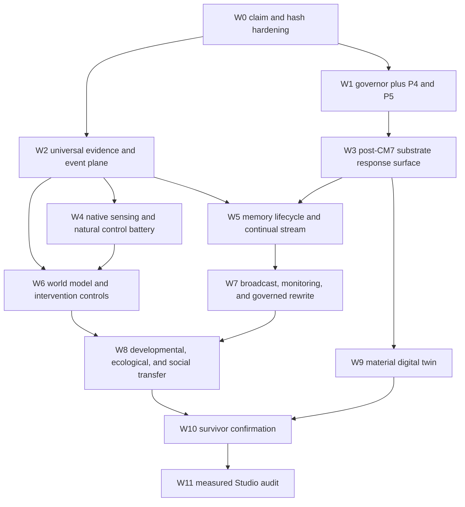

# MOP maximum-potential execution plan

Status: active local-exhaustion plan
Snapshot: 2026-07-10, America/Toronto
Research basis: `MOP_MAXIMUM_POTENTIAL_RESEARCH_2026_07.md`
Facet ledger: `MOP_POTENTIAL_ATLAS_2026_07.md` and `proof/MOP_POTENTIAL_ATLAS.json`
Claim audit: `docs/COMPLETION_CLAIM_AUDIT_2026_07_10.md`

## 1. Outcome

Raise every one of the 37 potential facets to an honest 10 out of 10 under the atlas definition:
all currently actionable local scaffolding, implementation, experiments, and confirmation are
complete, and every remaining gate is explicitly irreducible or a measured next-machine boundary.

Ten does not mean a favorable result. A preregistered null, refutation, or futility closure can
complete a facet. Ten also does not mean that unavailable participants, sensors, rights, specimens,
or external review have somehow been supplied. It means no local precursor, control, verifier,
simulator, interface, or handoff task remains undone.

The plan is a loop. Receipts override prose. The next wave is selected by decision value and
dependency leverage, not by model size or historical tier name.

## 2. Verified entry state

| Item | Current state | Consequence |
|---|---|---|
| Repository | HEAD `6e259c3`, dirty audit and implementation work preserved | Never reset or overwrite unrelated changes |
| Checked claims | 199 audited exactly once | Checked boxes are split into scaffolds, mechanics, pilots, nulls, positives, and stale claims |
| Potential atlas | 37 facets, weighted actionable realization 5.9/10 | Work is scored by S/I/E/C with bottleneck caps |
| Requirements | 291 rows, no category 8 or 9 | No earned Studio boundary |
| Non-F exhaustion | 177 rows accounted once, zero measured hardware blockers | Implementation, input, rights, and confirmation are first blockers |
| CM7 | Five-seed, 1,000-update bound null | Retire exact regime, retain platform contracts |
| Historical scale controls | Nine identity-bound random controls, promotion false, active lane retired | Preserve immutable history; use ViT-B/custom controls for new work |
| Dense official ViT-B | Strict load, finite 8/64-frame CPU forwards, and E6/DR14 integration | Runtime and implementation closed; natural cohort, caches, and verification remain |
| P4 | Full screen incomplete and resumable | Exclusive heavy-lane priority |
| P5 | Implemented, mechanics memory trace only | Run only after P4 releases the lane |
| Wave E0 | Event, branch, lifecycle, controls, and mutation verifier mechanics pass | Extend one shared evidence plane rather than fork experiment glue |
| P6 | Disk stream and exact resume pass at 384 events; four scheduler tasks are declared | Empty-lane 10k RSS probe, full 10k, full 100k, then conditional full 1m |
| Resource governor | 300-minute operational maximum, user-safe pause/resume | All heavy launches use declared policy tasks |
| Form boundary | Studio-only false | Hardware escalation remains a hypothesis |

## 3. Operating invariants

1. Frozen inherited encoders remain frozen.
2. Only the owned substrate lane may train.
3. Every scientific run declares a null, controls, independent units, metrics, and stop rule before
   observing the result.
4. One heavy lane is exclusive. Light implementation, tests, analysis, and docs may run in parallel.
5. The scheduler may signal only its own process group. It never kills, suspends, renices, or alters a
   user process.
6. The 40 GB free-disk floor is hard. Forecasts include output, atomic temporary space, and margin.
7. Operational legs may run up to 300 minutes. A frozen scientific configuration retains its own
   preregistered shard wall unless amended before new evidence is observed.
8. Source-drifted or partial scientific artifacts cannot be cited. Atomic resumable checkpoints are
   allowed only when their identity matches.
9. Nulls and failures receive the same receipt quality as positives.
10. No hardware row is created from a tier label, model name, projected speedup, or convenience.
11. A natural-data claim needs natural independent units. A causal claim needs intervention or an
    explicit identifiability assumption. A physical claim needs physical specimens.
12. No effect is promoted without a separate adversarial recomputation path.

## 4. Resource lanes

### Lane 0: exclusive heavy work

One declared CPU or MPS training, encoding, caching, or large simulation task. Admission requires
three consecutive good samples. The runtime governor monitors memory, memory pressure, swap,
thermal state, power source, disk forecast, MPS allocation where available, other scheduler lanes,
known foreground workloads, and unmanaged heavy processes.

### Lane 1: light implementation

Schemas, experiment harnesses, unit tests, verifier code, config validation, small deterministic
fixtures, and static analysis. It must not load model weights or decode media at scale.

### Lane 2: evidence and analysis

Receipt verification, hash audits, statistical recomputation, ledger regeneration, docs, rights
metadata, and no-download preflights.

### Serialized download lane

Downloads are hash-pinned, atomic, double-reserved, and subject to the disk floor plus margin. No
manual terms or license acceptance is automated.

## 5. Dependency graph



No later wave waits for an unrelated irreducible gate if its local prerequisites are green.

## 6. Wave 0: claim and receipt hardening

Status: substantially complete in this run.

### Work

- audit all 199 checked boxes at claim level;
- correct the false Studio-only Form boundary;
- materialize the CM7 receipt chain under repository-relative paths;
- bind the five-seed CM7 null into frontier localization;
- retire the stale CM8 seed requirement;
- make the scale atlas consume strict stimulus identity and all nine random controls;
- reclassify dense ViT-B runtime and E6/DR14 integration as complete, with natural inputs and
  verification as the first blockers;
- remove presumed Studio gates from active README, cold-start, scaling, Apple Silicon, and
  implementation entrypoints while preserving historical evidence;
- make the docs gate reject historical scale names and hardware-first labels in current entrypoints;
- regenerate requirements, frontier, exhaustion, Form, and docs ledgers in dependency order;
- preserve every null, failure, partial run, and stale input visibly.

### Exit

- every checked claim is classified exactly once;
- all authoritative hashes recompute;
- generated dependency hashes are current;
- no current prose reports an unmeasured Studio boundary;
- docs, lint, types, and tests pass.

## 7. Wave 1: adaptive local execution and current heavy frontier

### 7.1 P4 completion

Run the identical CPU resume through the governor until all registered cells close or a valid stop
receipt fires.

```bash
PYTHONPATH=src .venv/bin/python scripts/local_execution_throttle.py run \
  --task p4_resume_cpu \
  --run-id <unique-id> \
  --execute \
  --out proof/LOCAL_THROTTLE_P4_RUN.json
```

Required checks after each leg:

- source, config, cell registry, and checkpoint identity unchanged;
- partial cells resume from atomic checkpoints;
- disk floor and resource telemetry complete;
- full receipt, not smoke proof, determines completion;
- response surface uses off-ceiling and compute-matched cells;
- bootstrap and uncertainty use the registered independent units;
- favorable cells face frozen, random-target, restart, and stronger-shell attacks.

### 7.2 P5 sequence

Only after P4 releases Lane 0:

1. `p5smoke_cpu`;
2. `p5_traingrid_memory_probe_cpu`;
3. `p5pilot_cpu` seed-0 and off-ceiling staging;
4. remaining eligible seeds under preregistered promotion and futility rules.

The cold-process grid has identity-bound atomic row progress. The memory trace is mechanics until
capability, resource, and strongest-control results are joined.

### 7.3 P6, P7, and P9 rescan

Rebuild the queue after every material receipt rather than assuming old order:

- P6: the lifecycle and stream identities are strict at 384-event mechanics scope. Admit a 10,000
  event resource calibration, then 100,000 events, and reach one million only when the shorter rung
  leaves the horizon decision unresolved. Full rungs are 5 seeds x 2 schedules x 3 arms; later
  tasks consume the measured prior-rung RSS receipt rather than an invented memory estimate;
- P7: deterministic rendered observations, same-parent interventions, eight controls, and exact
  compute ledgers are complete. Do not scale the null fixture. Admit only independently sourced
  trajectories with an exact-referent control and predeclared replication;
- P9: causal monitoring, shifted-confounder controls, relief intervention, resume, and workload
  accounting are complete at fixture scope. Admit independent natural workload/failure episodes
  through the same harness; physical energy remains an external-meter gate.

### Exit

- P4 and P5 each have a complete, null, or valid stopped receipt;
- no mechanics artifact is promoted to a scientific result;
- the governor has demonstrated admission, checkpoint, safe yielding to foreground work, and resume;
- every material receipt triggers dependency-ordered ledger refresh.

## 8. Wave 2: universal evidence, event, and lifecycle substrate

This is the highest-leverage shared implementation wave.

### Deliverables

- `src/mop/substrate/events.py`: immutable `EventMeta`, entity, observation, branch, and clock types;
- `src/mop/environments/scenario_factory.py`: controlled occlusion, transform, split, merge, delay,
  action, damage, and repair scenarios;
- `src/mop/substrate/lifecycle.py`: append-only memory lifecycle journal with revision, availability,
  deletion, conflict, poisoning, and rollback;
- `src/mop/experiments/expansion_harness.py`: shared arm, control, resource, independent-unit, and stop
  contracts;
- `scripts/mop_expansion_wave0.py`: deterministic driver;
- `proof/EXPANSION_WAVE0.json`: mechanics-only composite receipt.

### Sentinels

- F23 persistent referent identity;
- F29 controllability boundary;
- F39 memory availability forecast.

### Controls

- wrong-time;
- wrong-event;
- appearance-only;
- action-blind;
- action-shuffled;
- stale-memory;
- unavailable-memory;
- identity ambiguity with required abstention;
- exact replay and mutation verifier.

### Exit

The same event bytes, branch identities, lifecycle state, controls, resources, and independent units
survive all three sentinels. No experiment-specific identity or storage glue is permitted.

## 9. Wave 3: native sensing and natural control battery

### 9.1 Canonical evidence migration

- migrate every citable cache to one strict manifest and referent/event schema;
- store per-input object and preprocessing hashes;
- forbid synthesized scientific IDs and manifestless citation;
- mutation-test source bytes, event, split, view, clock, and control joins.

### 9.2 Dense natural vision cache

Stream a small same-referent natural development cache through the official dense ViT-B instrument.
Keep the test partition sealed. Then build matched arms:

- learned frozen dense;
- exact-architecture random;
- handcrafted;
- pooled;
- compact owned;
- layer probes where supported.

Use off-ceiling object, relation, motion, event, and nuisance tasks. The output is a control battery,
not an architecture endorsement.

### 9.3 Native audiovisual intake

Acquire one rights-cleared cohort with original waveform and video clocks, session-level units,
license/privacy cards, and frozen splits. Implement audio-only, vision-only, compact fusion, shifted-
time, wrong-event, contradiction, missing-modality, and clock-drift controls.

### Exit

- one citable natural same-input learned/random/handcrafted/owned vision battery;
- one citable same-event native audiovisual cache with sealed test;
- no claim exceeds the development cohort or its independent-unit count.

## 10. Wave 4: post-CM7 owned-substrate response surface

The exact CM7 objective regime is retired. New cells must change one scientific premise, not merely
add time.

Candidate single-lever cells:

- immutable event state;
- object or slot state with explicit identity;
- compact recurrence;
- hierarchical or external memory;
- local eligibility traces;
- homeostatic update constraints;
- growth/pruning under fixed resource budgets;
- mode or routing topology;
- native audiovisual prediction;
- action-conditioned transition prediction.

Every cell has frozen, random, restart, stronger-shell, matched-active-FLOP, and matched-data-order
controls. Run proxy screens only after proxy rank validity is tested. Advance survivors using
sequential power and futility rather than an unconditional large grid.

### Exit

- independently verified response surface;
- each cell closed as survivor, null, refutation, or underpowered with a calculated next unit count;
- architecture decisions cite controlled effects, not labels or parameter count.

## 11. Wave 5: unified memory and long-stream plasticity

Status: the shared disk stream, hash chain, atomic cursor, abrupt/gradual schedules, replay,
no-replay, fresh-init controls, and endpoint schemas are implemented and verified at 384-event
mechanics scope. Scale, replication, independent metric replay, and scientific interpretation remain.

### Implementation

- event-sourced episodic, semantic, prospective, and working stores;
- exact availability and retrieval logs;
- replay scheduling and no-replay control;
- revision, reconsolidation, deletion, poisoning, and recovery;
- matched active bytes and compute;
- disk-backed progressive 10,000, 100,000, and conditional million-event stream with exact resume;
- gradual and abrupt environment changes;
- freshly initialized and fixed-topology controls.

### Endpoints

- retention;
- acquisition;
- future learnability;
- calibration;
- stale-memory harm;
- deletion completeness;
- prospective utility;
- resource cost;
- transfer to new sessions or worlds.

### Exit

A long-stream verifier independently reproduces the lifecycle and separates useful retention from
capacity, replay volume, and extra compute.

## 12. Wave 6: world model, intervention, and active sensing

The deterministic P7 mechanics pass already compares reactive, model-free, compact latent,
object-centered, oracle-state, action-blind, action-shuffled, and equal-depth controls. Both learned
planners lost to the reactive baseline, so the exact fixture is closed as a mechanics-level null.
The next wave reuses the same evidence surface on independently sourced trajectories rather than
making the model larger.

Add:

- held-out worlds and objects;
- active sensor selection with explicit cost;
- delayed effects and partial observability;
- tool attachment and boundary changes;
- same-state counterfactual branches;
- exploitation and model-error traps;
- exact replay and horizon analysis.

### Exit

The local verifier already reports the terminal fixture null, horizon degradation, calibration,
planning benefit, and exact cost. A later scientific exit requires the same controls and metrics on
predeclared external units without violating the exact-referent control.

## 13. Wave 7: causal broadcast, self-monitoring, and governed rewrite

### Broadcast and monitoring

- preserve P9's completed same-parent telemetry interventions, shifted-proxy controls, calibration,
  relief utility, resume, and accounting mechanics;
- replace the structural fixture with prospectively registered independent workload/failure units;
- limited, global, and no-broadcast conditions at matched bandwidth;
- lesion, injection, restoration, and stale-message controls;
- telemetry-based error/resource forecasts;
- calibrated abstention;
- measured avoided compute;
- separation of report, routing, prediction, and memory endpoints.

### Rewrite drill

- proposal and authority token;
- shadow and canary execution;
- conflict detection;
- interrupt and atomic rollback;
- forged authority and evaluator-tampering controls;
- source, config, and memory provenance;
- improvement and regression gates.

### Exit

An independent construct-dissociation verifier and transactional threat receipt close every local
failure mode, including poisoned memory and partial writes. P9's monitoring mechanics are already
green; this exit still requires external-workload replication, broadcast, and governed rewrite.

## 14. Wave 8: developmental, ecological, and social transfer

### Bounded developmental ecology

- held-out generated worlds;
- staged sensorimotor competencies;
- play, tool acquisition, damage, repair, and transfer;
- fixed and adaptive curricula;
- shuffled-stage and equal-data controls;
- population and environment diversity under a fixed horizon;
- archive turnover, novelty, competence, and resource metrics.

### Simulated partner populations

- joint reference;
- communicative repair;
- teaching at equal information;
- self-play and held-out partner controls;
- reset and inheritance across generations;
- partner and generation transfer.

### Exit

Receipts demonstrate transfer caused by ordered history, environment diversity, or shared reference,
or close each proposed lever with a durable null. Fluent output alone is never an endpoint.

## 15. Wave 9: material digital twin

Implement three material priors and matched digital reservoirs:

- distributed recurrent fading memory;
- ionic or history-dependent drift;
- local growth and repair.

Test calibration, noise, aging, damage, reconnection, repeated virtual specimens, observability,
controller overhead, task transfer, latency, and energy proxy. Produce a bench protocol only if a
material prior beats a tuned conventional control on a named Pareto axis.

### Exit

- digital-twin falsification receipt;
- exact specimen count and physical measurements required for the next stage;
- no simulated result described as physical validation.

## 16. Wave 10: survivor confirmation

For every surviving effect:

1. define the real independent unit;
2. calculate power from session, episode, world, partner, or specimen variance;
3. freeze fresh referents and test partitions;
4. preregister multiplicity, futility, and smallest effect of interest;
5. run a separate verifier implementation;
6. test transfer across at least one task, environment, or substrate where the claim requires it;
7. write a promotion receipt or terminal null.

No failed or underpowered survivor is hidden. The survivor set may legitimately become empty.

## 17. Wave 11: measured Studio audit

Only survivors enter this wave. A candidate must supply:

- named effect and scientific requirement;
- independent-unit count;
- measured local memory, bandwidth, latency, wall time, storage, and failure profile;
- three valid local attempts;
- results of streaming, caching, factorization, recurrence, precision, sequential-seed, and bounded-
  input attacks;
- proof that at least one local reduction changes the estimand or decision;
- smallest enabling rung;
- parity-preserving next-rung pilot.

Classify the result as:

- no hardware case;
- measured throughput benefit only;
- measured scientific necessity;
- beyond a Studio because the blocker is non-compute.

If no candidate passes, the correct conclusion is no purchase recommendation.

## 18. Regeneration order after material changes

1. stabilize raw experiment receipts and portable CM7 chain;
2. regenerate the scale atlas only if identity or control caches changed;
3. regenerate project exhaustion;
4. regenerate frontier localization and local preflights;
5. rebuild and check extended-compute requirements;
6. refresh the completion-claim audit if its bound inputs changed;
7. regenerate the potential atlas if any scored evidence changed;
8. regenerate Form scorecard and boundary artifacts when their inputs changed;
9. run docs drift checks;
10. run focused tests, then the full suite.

Commands:

```bash
.venv/bin/python scripts/project_experiment_exhaustion.py --ledger
.venv/bin/python scripts/frontier_localization.py
.venv/bin/python scripts/build_extended_compute_requirements.py
.venv/bin/python scripts/build_extended_compute_requirements.py --check
.venv/bin/python scripts/check_docs.py
.venv/bin/python -m pytest
```

Generated artifacts are never hand-edited.

## 19. Facet update rule

After each wave, update every affected facet's four subscores:

- S: contracts, identities, controls, metrics, refusal rules, tests;
- I: end-to-end local execution, resume, failure behavior;
- E: appropriate experiments on appropriate independent units;
- C: recomputation, uncertainty, transfer, external validity.

Apply the bottleneck caps and record the evidence paths. A score may fall when an audit discovers a
weaker claim boundary. That is progress because the atlas becomes more truthful.

## 20. Terminal condition

The plan closes only when:

- every local queue item is complete, null, refuted, or validly stopped;
- all 37 facets are at 10 under the actionable definition or show an exact remaining irreducible
  gate with every local precursor complete;
- no stale generated hash remains;
- the full verification suite passes;
- remaining items are partitioned into human/data/rights, environment/sensor, participant/specimen,
  measured hardware benefit, measured hardware necessity, and closed science;
- the next boot command is exact;
- any Studio recommendation names the configuration and the experiment it uniquely enables.

Until those conditions hold, return to scan, pick, preflight, execute, verify, record, reclassify,
and loop.
