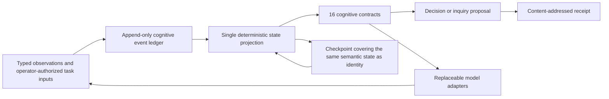

# Final Revision Architecture Specification

## Claim boundary

The selected provisional kernel is the simplest sufficient candidate: a
task-independent, event-sourced monolithic persistent core. It owns semantic
state, accepts typed events, produces deterministic projections and
content-addressed receipts, and restores exactly from a checkpoint. It is not
an LLM wrapper and requires neither a tensor runtime nor a permanent model.

This selection does not establish architectural or functional Nous advantage.
The historical `terminal_closed_null` remains immutable, and the new
non-saturated pilot also ties the selected kernel with the strongest
task-independent S2 persistent alternative.

## Boundary and flow

## Owned state

The projection owns identity, logical time, observations, seven memory types,
beliefs, warranted knowledge, goals and unfinished work, world and self models,
reasoning and inquiry receipts, the model registry, body and tool state,
bounded learning state, and all receipts. Transient model context is excluded.

## Fail-closed rules

- Unknown event kinds and malformed payloads are refused.
- Knowledge requires an undefeated belief with confidence at least 0.8.
- Counterfactuals declare changed and held-fixed variables.
- Learning uses construction data only, requires held-out improvement and
  retention, and records rollback state.
- Checkpoint and event-chain tampering are rejected.
- Model replacement cannot change identity or discard unfinished goals.
- External activation remains false.

## Why this kernel

All locally implemented tournament prototypes conformed to the same contracts
and tied on the bounded fixture. Candidate I had the lowest declared complexity
while adding deterministic replay and auditable receipts to the persistent
organization already shown by S2. Candidate H was admitted: four independent
Grok cells returned original proposals, cross-examination selected the
Intervention-Indexed Dual-Timeline Causal Ledger, and it was implemented as
`H_causal_temporal_ledger` and entered in the bounded tournament, where it tied
the field at greater declared complexity. The selection is an engineering
default under a behavioral tie and a mechanism null, not positive architectural
evidence.
